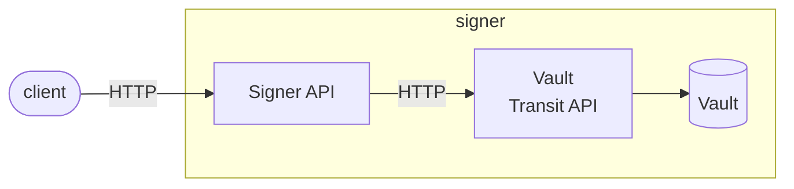

[](https://github.com/eclipse-xfsc/crypto-provider-service/-/commits/main)
[](https://github.com/eclipse-xfsc/crypto-provider-service/-/commits/main)

# signer

Signer service provides REST API for creating Verifiable Credentials (VC) and
Verifiable Presentations (VP) in the [W3C 1.0 credential format](https://www.w3.org/TR/vc-data-model/).
It also provides more generic endpoints for signing arbitrary data, for adding
cryptographic proofs to existing VC/VP and for fetching public keys necessary 
for signature verification.

It is developed using the [Goa v3](https://goa.design/) framework.

> A helper script named `goagen.sh` can be found inside the root directory of 
> the service. It can be used to generate the transport layer code from the 
> Goa DSL definitions in the [design](./design) directory. The script should 
> be executed everytime the design definitions are updated. It also generates
> updated OpenAPI documentation from the DSL.

### OpenAPI Documentation

[Swagger Web UI](./gen/http/openapi3.json)

In the local docker-compose environment a live Swagger UI is exposed at http://localhost:8085/swagger-ui/.

### High-level Overview


### Formats

The signer supports linked data proofs and optionally sd-jwt(experimental). Sd-JWT is not yet finally standardized, so the implementation is just an experimental demonstration how to do it. SD- Jwt used the sd-jwt service (https://gitlab.eclipse.org/eclipse/xfsc/common-services/sd-jwt-service). It support also just did:jwk as proof signature.

#### 1. Linked Data Proofs

can be created by using credential proof route: 

```
{
    "namespace" :"xyz",
    "group" : "xyz",
    "key":"test",
    "format":"ldp_vc",
    "credential":{
  "@context": [
	"https://www.w3.org/2018/credentials/v1",
	"https://w3id.org/security/suites/jws-2020/v1",
	"https://schema.org"
  ],
  "credentialSubject": {
    "id":"did:jwk:eyJhbGciOiJFUzI1NiIsImNydiI6IlAtMjU2Iiwia3R5IjoiRUMiLCJ4IjoibE01NDNya2xwUUV3T2oyMFowRmdnMUhjMHlkZlhJRU05ckEzRzNSNXdFVSIsInkiOiJvVERYTVNuOWxlMGhrMC1pemFHRUF5OFBxT2pncWUtNWpVMldzbEZBcUw0In0",
	"testdata": {"hello":"world", "testXY":"1234"}
  },
  "issuanceDate": "2022-06-02T17:24:05.032533+03:00",
  "issuer": "https://example.com",
  "type": "VerifiableCredential"
}
}

```

#### 2. SD-JWT Proof

can be created by the following structure.DisclosureFrame describes what to be disclosed.  

``` 
{
    "namespace" :"xyz",
    "group" : "xyz",
    "key":"test",
    "format":"vc+sd-jwt",
    "credential":{
  "@context": [
	"https://www.w3.org/2018/credentials/v1",
	"https://w3id.org/security/suites/jws-2020/v1",
	"https://schema.org"
  ],
  "credentialSubject": {
    "id":"did:jwk:eyJhbGciOiJFUzI1NiIsImNydiI6IlAtMjU2Iiwia3R5IjoiRUMiLCJ4IjoibE01NDNya2xwUUV3T2oyMFowRmdnMUhjMHlkZlhJRU05ckEzRzNSNXdFVSIsInkiOiJvVERYTVNuOWxlMGhrMC1pemFHRUF5OFBxT2pncWUtNWpVMldzbEZBcUw0In0",
	"testdata": {"hello":"world", "testXY":"1234"}
  },
  "issuanceDate": "2022-06-02T17:24:05.032533+03:00",
  "issuer": "https://example.com",
  "type": "VerifiableCredential"
},
"DisclosureFrame": ["testdata"]
}

```

#### Crypto Engines

The current signer supports multiple crypto engines, which can be loaded from the internal image by setting the var ENGINE_PATH to the availble engine. 

### Configuration

The signer service is configured using the [Configuration File](./internal/config/config.go).
All configurations are expected as Environment variables specified in the
configuration file. For managing the configuration data from ENV variables,
[envconfig library](https://github.com/kelseyhightower/envconfig) is used.

### Hashicorp Vault

The service uses Hashicorp Vault for crypto operations and storage of key material. The
Vault client is defined as Go interface, so an implementer can provide different 
crypto engine implementations for crypto operations and key storage.

Vault setup is described [here](https://developer.hashicorp.com/vault/docs/install). 
When it's up and running, the [Vault Transit Engine](https://developer.hashicorp.com/vault/docs/secrets/transit) 
must be enabled and at least one asymmetric key should be created inside for use 
by the Signer service. The Vault provides Web UI interface and a terminal CLI 
application which can be used to manage Vault Engines and keys.

### Signing Key

When a client requests a proof or creates a VC, it must specify the name of the transit 
engine, (optionall engine type if no transit engine e.g. kv or transit;kv) and signing key to be used. The key must be of a supported type, as not all key types can be used for generating signatures.

#### Supported key types

> Check out Hashicorp Vault docs for all [supported key types](https://www.vaultproject.io/api-docs/secret/transit#type-1) 
> by Vault Transit Engine. Keep in mind, that not all Vault key types are supported 
> by the Aries framework signature suites and the Signer service (for example RSA). 
> Keys we have tested with are ECDSA and ED25519 for VC/VP, while for signing arbitrary
> data used for policy bundles signing, all asymmetric key types are supported
> (including RSA).

### Public Keys

The service exposes two endpoints for getting public keys - one for getting
a single key by name and the other for getting all possible public keys of
the signer service.

The keys are returned in JWK format and are wrapped in a DID Verification Method
envelope, so that the response can be used more easily during DID proofs verification
process. Example key response:

```json
{
  "id": "key1",
  "publicKeyJwk": {
    "crv": "P-256",
    "kid": "key1",
    "kty": "EC",
    "x": "RTx_2cyYcGVSIRP_826S32BiZxSgnzyXgRYmKP8N2l0",
    "y": "unnPzMAnbByBMq2l9WWKsDFE-MDvX6hYhrESsjAaT50"
  },
  "type": "JsonWebKey2020"
}
```
### Terms of Use

Terms of Use can be appended via Policy. Under the Variable TERMSOFUSE_POLICY can be a policy configured which can return service endpoints which are inserted in the did doc during generation. The policy is called via POST, expects a field tenant and group and must return the following structure: 

```
{
{
	"result": [
		{
			"id": "http://example.com/policies/credential/4",
			"profile": "http://example.com/profiles/credential",
			"type": "IssuerPolicy"
      ...
		}
	]
}
}
```


### DID Document Generation

The service is able to generate now did documents for a dedicated engine. It lists for a engine all keys in verification methods when the method is called (see open api). The method is [designed](https://github.com/eclipse-xfsc/crypto-provider-service/-/blob/main/design/design.go?ref_type=heads#L156) to be used by load balancer over passing the  X-Headers. Headers: 

|Header|Purpose|
|------|-------|
|X-namespace| Namespace of the Keys|
|X-group|Group of the keys, can be empty|
|X-engine|Type of the Engine, can be kv and/or transit seperated by ; |
|X-did| DID which shall be used inside of the document as basis id for referencing the keys|

Service Endpoint Policy Usage: Under the Variable SERVICE_ENDPOINT can be a policy configured which can return service endpoints which are inserted in the did doc during generation. The policy is called via POST, expects a field did and must return the following structure: 

```
{
  "result":[
    {
      "id":"xxxx",
      "type":"xxxx",
      "serviceEndpoint":"xxxx"
    }
  ]
}
```


### DID Configuration Generation

The did configuration is generated according to [W3C Did Configuration Spec](https://identity.foundation/.well-known/resources/did-configuration/) and [designed](https://github.com/eclipse-xfsc/crypto-provider-service/-/blob/main/design/design.go?ref_type=heads#L184) to be used by load balancers over passing the X-Headers. Headers:  

|Header|Purpose|
|------|-------|
|X-namespace| Namespace of the Keys|
|X-group|Group of the keys, can be empty|
|X-did| DID which shall be used inside of the document as basis id for referencing the keys|
|X-origin| Origin which shall be proven by the did config e.g. https://example |
|X-nonce| Nonce for creating the proof on the did config. |


### JWKS Document Generation

The jwks endpoint generates an standard jwk key set output which can be used for open id or other key set purposes. It's also [designed](https://github.com/eclipse-xfsc/crypto-provider-service/-/blob/main/design/design.go?ref_type=heads#L199) to be used over loadbalancers by using x-headers. Headers: 

|Header|Purpose|
|------|-------|
|X-namespace| Namespace of the Keys|
|X-group|Group of the keys, can be empty|
|X-engine|Type of the Engine, can be kv and/or transit seperated by ; |

### Build

#### Goa Build 

```
goa gen github.com/eclipse-xfsc/crypto-provider-service/design
```

#### Local binary
To make the service binary locally, you can run the following command from the root
directory (you must have [Go](https://go.dev/) installed):
```shell
go build -o signer ./cmd/signer/...
```

#### Docker image

You can see the Dockerfile of the service under the [deployment](./deployment) directory.
There is one Dockerfile for use during local development with docker-compose and one for
building an optimized production image: [deployment/docker/Dockerfile](./deployment/docker/Dockerfile).

### Versioning

There is one global exported variable named `Version` in [`main.go`](https://github.com/eclipse-xfsc/crypto-provider-service/-/blame/main/cmd/signer/main.go?ref_type=heads#L38) 
This variable is set to the latest tag or commit hash during the build process. You can
look in the production Dockerfile to see how the Version is set during build. The version
is printed in the service log on startup and can be checked to verify which specific version
of the code is deployed.

> Version should *not* be set or modified manually in the source code.

### VC/VP verification

When given a VC/VP for verification, the service checks the validity of the JSON structure
against the included schemas (`context`), and verifies all proofs inside. Additional custom
verifiers could be written to extend the verification process. Currently, there is one such
extended verification component named `train`. It can be used as an example for how to write
more verifications if needed.

#### [TRAIN](https://gitlab.eclipse.org/eclipse/xfsc/train)

Extended verification modules are enabled by a configuration variable and the corresponding
implementation. The ENV variable that specifies extended verifiers is named `CREDENTIAL_VERIFIERS`
and holds comma-separated strings which denote a particular verifier implementation. Inside the
service all listed verifiers are constructed and used during the VC verification process.
```shell
CREDENTIAL_VERIFIERS="train,mynewverifier"
```

> Of course, for `mynewverifier` to be a usable option, it must have been implemented inside
> the service and created when its name is given in the config.

All extended verifiers implement a common interface and provide two methods.
```go
type Verifier interface {
	VerifyCredential(ctx context.Context, vc *verifiable.Credential) error
	VerifyPresentation(ctx context.Context, vp *verifiable.Presentation) error
}
```

### Logging

The service outputs all logs to `stdout` as defined by the best practices in the Cloud Native
community. See here for more details [12 Factor App](https://12factor.net/logs).
From there logs could be processed as needed in the specific running environment.
The standard log levels are `[debug,info,warn,error,fatal`] and `info` is the default level.
If you want to set another log level, use the ENV configuration variable `LOG_LEVEL` to set it.

### Dependencies and Vendor

The project uses Go modules for managing dependencies and we commit the vendor directory.
When you add/change dependencies, be sure to clean and update the vendor directory before
submitting your Merge Request for review.

```shell
go mod tidy
go mod vendor
```

### Tests and Linters

To execute the units tests for the service go to the root project directory and run:

```shell
go test -race $(go list ./... | grep -v /integration)
```

To run the linters go to the root project directory and run:
```shell
golangci-lint run
```

### Integration Tests

Integration tests are inside the [integration](./integration) directory.
The only configuration option they need is the base URL of the signer service.
It must be specified in the `SIGNER_ADDR` environment variable. 
The tests can be executed against different environments by setting the
value for `SIGNER_ADDR`.

```shell
SIGNER_ADDR=https://{{SIGNER_ADDRESS}} go test
```

> Note: these tests are not executed in the CI pipeline currently.

## Dependencies

[Dependencies](go.mod)

## Deployment

### Helm

[Link to Helm README](deployment/helm/README.md)

## License

[Apache 2.0 license](LICENSE)
